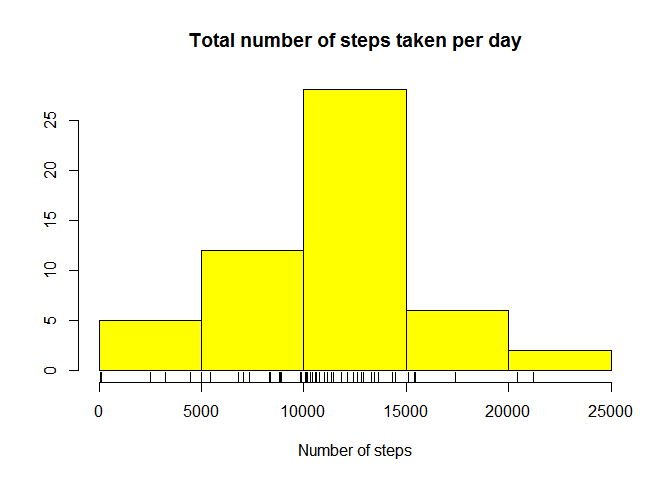
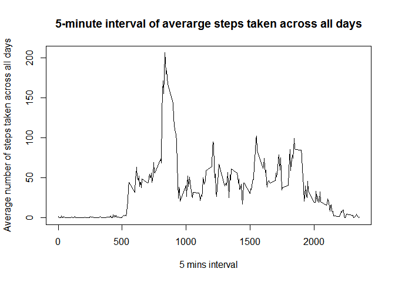
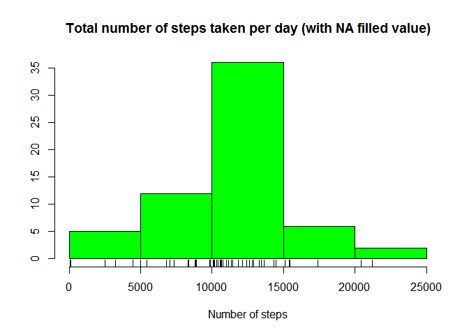
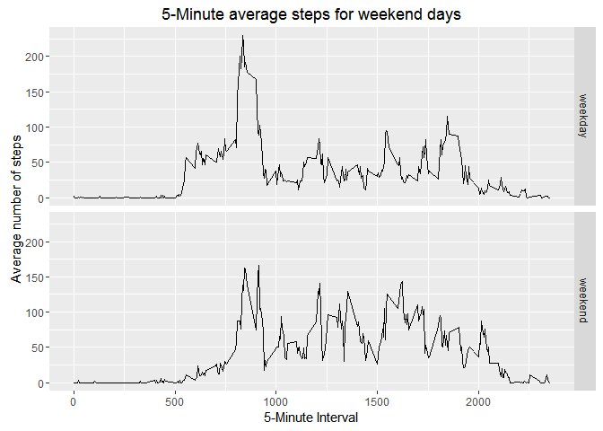

# RepData_PeerAssessment1
Brice Castelain  
Sunday, April 03, 2016  


## Loading and preprocessing the data


```r
    # Reading activity file to analyse data
    activity <- read.csv("activity.csv")
    
    # Removing NAs from data frame
    actNoNA <- activity[!is.na(activity$steps),]
```


## What is mean total number of steps taken per day?


```r
    # ==========================================================================================
    #   What is the mean total number of steps taken per day
    # ==========================================================================================
    
    # 1 Sum total steps per day
    dfSum <- aggregate(steps ~ date, data = actNoNA, FUN = sum)
 
    dfSum$date <- as.Date(dfSum$date, format = "%Y-%m-%d")
    
    
    # 2 Creation of the histogram of total number of steps taken per day 
    hist(dfSum$steps,
         main="Total number of steps taken per day", 
         xlab="Number of steps", 
         ylab="",
         breaks=5,
         col="yellow")
    rug(dfSum$steps)
```

<!-- -->

```r
    # 3 Calculating / reporting the mean and median of the total number of steps taken per day
    mean(dfSum$steps) 
```

```
## [1] 10766.19
```

```r
    median(dfSum$steps) 
```

```
## [1] 10765
```

####  Histograms plot binned quantitative data while bar charts plot categorical data. Bars can be reordered in bar charts but not in histograms. (forbes.com)

## What is the average daily activity pattern?


```r
# 1 Line plot of 5-minutes interval (x-axis) by the average number of steps taken, averaged across all days (y-axis)
    dfMean <- aggregate(steps ~ interval, data = actNoNA, FUN = mean)
    
    with(dfMean, 
         plot(interval, 
              steps,  
              type = "l", #Plot with lines
              xlab = "5 mins interval",  #No labels on x-axis
              ylab = "Average number of steps taken across all days"))
    title("5-minute interval of averarge steps taken across all days")
```

<!-- -->

```r
    # 2 On average across all the days in the dataset, the maximum number of steps in which interval
    floor(max(dfMean$steps))
```

```
## [1] 206
```

```r
    dfMean[dfMean$steps ==  max(dfMean$steps),]
```

```
##     interval    steps
## 104      835 206.1698
```

#### The 5-minute interval (835) across all days on average has the maximum steps on average 206.

## Imputing missing values

#### The strategy to fill missing values is taking the mean for each 5-minute intervals and fill the missing values for
#### every specific 5-minute interval.


```r
 # ==========================================================================================
    #   Imputing missing values
    # ==========================================================================================
    
    # 1 Count NA values in the steps column
    nrow(activity[is.na(activity$steps),])
```

```
## [1] 2304
```

```r
    # 2 Filling missing NA data by using the mean of 5-minute interval to corresponding NA interval as filler    
    # 3 Creating the new dataset with filled missing values
    actFilled <- activity
    actFilled[(actFilled$interval == dfMean$interval) & (is.na(actFilled$steps)) ,]$steps <- dfMean$steps
    
    # The average steps in each 5-minute interval must be floored in order to remove decimals
    actFilled$steps <- floor(actFilled$steps)
    
    # 3 Creating histogram, calculating mean and median with filled value dataset
    
    dfSumFilled <- aggregate(steps ~ date, data = actFilled, FUN = sum)
    
    # Converting to Date object
    dfSumFilled$date <- as.Date(dfSumFilled$date, format = "%Y-%m-%d")
    
    
    # 4 Creation of the histogram of total number of steps taken per day 
    hist(dfSumFilled$steps,
         main="Total number of steps taken per day (with NA filled value)", 
         xlab="Number of steps", 
         ylab="",
         breaks=5,
         col="green")
    rug(dfSumFilled$steps)
```

<!-- -->

```r
    mean(dfSumFilled$steps) 
```

```
## [1] 10749.77
```

```r
    median(dfSumFilled$steps) 
```

```
## [1] 10641
```
#### The imputing of new values has augmented the number of observations, hence the frequency on the histogram.

## Are there differences in activity patterns between weekdays and weekends?


```r
library(ggplot2)
```

```
## Warning: package 'ggplot2' was built under R version 3.2.3
```

```r
    # ==========================================================================================
    #   Are there differences in activity patterns between weekdays and weekends ?
    # ==========================================================================================

    # Converting to Date object
    actFilled$date <- as.Date(actFilled$date, format = "%Y-%m-%d")
    
    # Adding new column with weekday for each date
    actFilled$day <- weekdays(actFilled$date)

    # Filling flag to know if weekend or weekday
    actFilled$weekDayFlag <- ifelse( actFilled$day == "samedi" | 
                                     actFilled$day == "dimanche", "weekend", "weekday" )
    
    # Convertion of weekDayFlag to factor
    actFilled$weekDayFlag <- as.factor(actFilled$weekDayFlag)
    
    # Calculating the mean of steps per 5-minute interval for weekend days
    dfFilledMeanWE <- aggregate(steps ~ interval, 
                                data = actFilled[actFilled$weekDayFlag == "weekend",], FUN = mean)

    # Calculating the mean of steps per 5-minute interval for week days
    dfFilledMeanWD<- aggregate(steps ~ interval, 
                               data = actFilled[actFilled$weekDayFlag == "weekday",], FUN = mean)
    
    # Adding new empty column to data frame that will contain the average steps per 5-minute interval
    actFilled[, "stepsMeanPerInt"] <- NA
    
    # Filling new column with steps mean per 5-minute interval for weekend days and for week days
    actFilled[actFilled[actFilled$interval == dfFilledMeanWE$interval, ]$weekDayFlag == 
                  "weekend", ]$stepsMeanPerInt <- floor(dfFilledMeanWE$steps)
    
    actFilled[actFilled[actFilled$interval == dfFilledMeanWD$interval, ]$weekDayFlag == 
                  "weekday", ]$stepsMeanPerInt <- floor(dfFilledMeanWD$steps)

    ggplot(data=actFilled,
           aes(x=interval, y=stepsMeanPerInt)) +
		geom_line() +
		facet_grid(weekDayFlag ~ .) +
		ggtitle("5-Minute average steps for weekend days") +
		labs(y="Average number of steps") +
		labs(x="5-Minute Interval") 
```

<!-- -->

